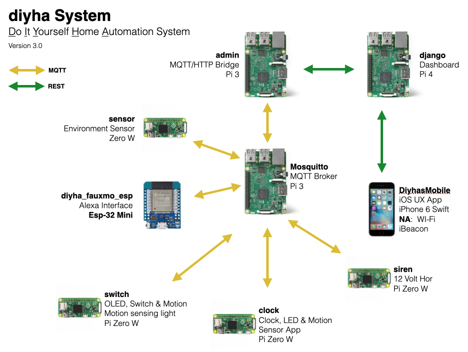

# whoview
The WhoView class is used respond to the MQTT topic **diy/system/who**. This class is one of five general classes in my *do it yourself home automation system* (**DIYHA**). Each python DIYHA application is hosted on a Raspberry Pi server and will respond to a **diy/system/who** subscribed topic and report on their status, hostname and IP address. 
- Note - Some DIYHA applications have an additional diy/system/who user interface, e.g., 8x8 matrix or seven segment LED, to display their IP address in a project specific MVC view. 

[](https://opensource.org/licenses/MIT)

[](https://svgshare.com/i/Zhy.svg)

> Live demo [_here_](https://www.example.com). <!-- If you have the project hosted somewhere, include the link here. -->

## Table of Contents
* [General Info](#general-information)
* [Technologies Used](#technologies-used)
* [Features](#features)
* [Screenshots](#screenshots)
* [Architecture](#architecture)
* [Setup](#setup)
* [Usage](#usage)
* [Project Status](#project-status)
* [Room for Improvement](#room-for-improvement)
* [Acknowledgements](#acknowledgements)
* [Contact](#contact)
<!-- * [License](#license) -->


## General Information
- Provide general information about your project here.
  - This is one of five classes used in my home automation system (**DIYHA**). I've used OOP and MVC concepts in my DIYHA system. 
- What problem does it (intend to) solve?
  - I wanted to isolate the who server identification status into a single class. The main python application subscribes to a **diy/system/who** topic and responds by turning on or off who messages.
- What is the purpose of your project?
  - My home automation system contains environment sensors, motion sensors, LED clocks, light switches, emergency sirens, a django web server, interfaces to Adafruit.io and a mosquitto MQTT broker.
- Why did you undertake it?
  - This was a fun project to learn about python, Raspberry Pi, Arduino processors, hardware and more.
<!-- You don't have to answer all the questions - just the ones relevant to your project. -->

## Technologies Used
- python - version 3.7.3
- paho.mqtt.client - version TBD

## Features
List the ready features here:
- Handles the basic **diy/system/who** functions
- Reports on status, hostname and IP address by way of a MQTT publish and LOGGING info message.
- Code passes pylint with a score of 10.0

## Screenshots
Not applicable.
<!-- -->
<!-- If you have screenshots you'd like to share, include them here. -->

## Architecture

<!-- If you have screenshots you'd like to share, include them here. -->

## Setup
What are the project requirements/dependencies? Where are they listed? A requirements.txt or a Pipfile.lock file perhaps? Where is it located?
- git clone the repository and then copy the python file to the **pkg_classes** directory of an relevant DIYHA applicattions on the server.

Proceed to describe how to install / setup one's local environment / get started with the project.
```
git clone
```
- Copy the python files to the relevant applications
```
cp *.py ../asset/pkg_classes
cp *.py ../clock/pkg_classes
cp *.py ../server/pkg_classes
cp *.py ../switch/pkg_classes
cp *.py ../siren/pkg_classes
```

## Usage
How does one go about using it?
Provide various use cases and code examples here.

```
├── asset.py
├── asset.service
├── LICENSE
├── logging.ini
├── pkg_classes
│   ├── configmodel.py
│   ├── djangoview.py
│   ├── statuscontroller.py
│   ├── testview.py
│   ├── topicmodel.py
│   └── whoview.py
├── README.md
├── requirements.txt
├── systemd_script.sh
```
- Example from the **asset.py** DIYHA application
```
from pkg_classes.whoview import WhoView
```
- initialization of the view controller
```
# get the command line arguements
CONFIG = ConfigModel(LOGGING_FILE)

# setup web server updates
DJANGO = DjangoModel(LOGGING_FILE)
DJANGO.set_django_urls(CONFIG.get_django_api_url())

# Set up who message handler from MQTT broker and wait for client.
WHO = WhoView(LOGGING_FILE, DJANGO)
```
- provide MQTT client
```
WHO.set_client(CLIENT)
```
- process diy/system/who topic subscription
```
client.subscribe("diy/system/who", 1)
```
- handling diy/system/who messages
```
TOPIC_DISPATCH_DICTIONARY = {
    "diy/system/test":
        {"method": system_message},
    "diy/system/who":
        {"method": system_message}
}

def system_message(client, msg):
    """ Log and process system messages. """
    # pylint: disable=unused-argument
    LOGGER.info(msg.topic + " " + msg.payload.decode('utf-8'))
    if msg.topic == 'diy/system/test':
        TEST.on_message(msg.payload)
    elif msg.topic == 'diy/system/who':
        if msg.payload == b'ON':
            WHO.turn_on()
        else:
            WHO.turn_off()
```

## Implementation Status


## Room for Improvement
Include areas you believe need improvement / could be improved. Also add TODOs for future development.

Room for improvement:
- Further refactoring to more generalize the class

To do:
- Integrate into other DIYHA applications and repositories
- Develop a new installation process for seperate repositories


## Acknowledgements
Give credit here.
- This project was inspired by...
- This project was based on [this tutorial](https://www.example.com).
- Many thanks to...


## Contact
Created by [@parttimehacker](http://parttimehacker.io/) - feel free to contact me!
### Repository Stats

### Repository Languages

### HITS


<!-- Optional -->
<!-- ## License -->
<!-- This project is open source and available under the [... License](). -->

<!-- You don't have to include all sections - just the one's relevant to your project -->
